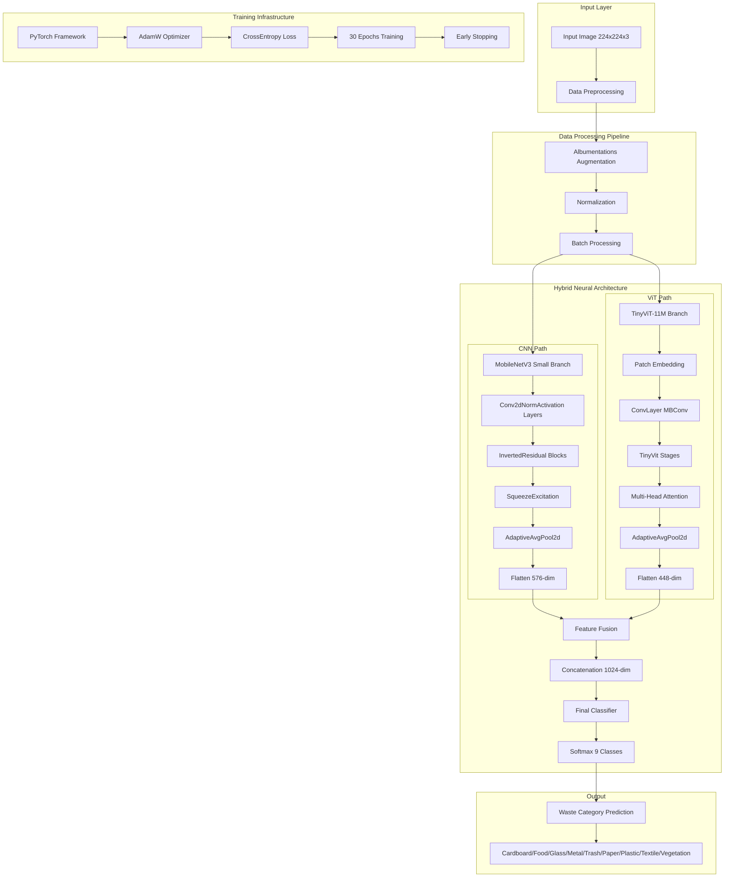
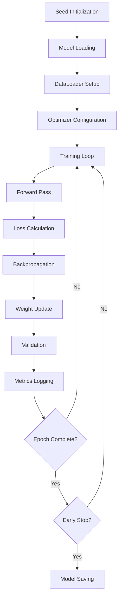

# Waste Classification System Architecture & Design

## Overview
This document outlines the complete architecture and system design for a hybrid CNN-Transformer waste classification model that combines MobileNetV3 and TinyViT architectures for real-world waste detection.

## System Architecture Diagram



## Model Architecture Details

### 1. Hybrid CNN-Transformer Design

#### MobileNetV3 Small Branch (CNN Path)
- **Input**: 224×224×3 RGB images
- **Architecture**: 
  - 13 Conv2dNormActivation layers
  - 11 InvertedResidual blocks with SqueezeExcitation
  - Hardswish and ReLU activations
- **Output Features**: 576-dimensional feature vector
- **Pretrained**: ImageNet weights

#### TinyViT-11M Branch (Transformer Path)
- **Input**: 224×224×3 RGB images
- **Architecture**:
  - Patch Embedding (3→64 channels)
  - 4-stage hierarchical design
  - Multi-Head Self-Attention (4, 8, 14 heads)
  - Local convolution integration
- **Output Features**: 448-dimensional feature vector
- **Pretrained**: ImageNet weights

#### Feature Fusion Layer
- **Concatenation**: 576 + 448 = 1024 dimensions
- **Final Classifier**: Linear layer → 9 output classes
- **Activation**: Softmax for probability distribution

### 2. Data Pipeline Architecture


#### Data Augmentation Strategy
- **Training Augmentations**:
  - RandomResizedCrop (scale: 0.8-1.0, ratio: 0.75-1.33)
  - HorizontalFlip (p=0.5)
  - Rotation (±15°, p=0.5)
  - Brightness/Contrast adjustment (p=0.5)
  - ImageNet normalization

- **Validation Processing**:
  - Resize to 224×224
  - ImageNet normalization
  - No augmentation (deterministic)

### 3. System Components

#### Core Dependencies
```python
PyTorch 2.0+           # Deep Learning Framework
torchvision           # Computer Vision Models
timm                  # Transformer Models
albumentations        # Advanced Augmentations
scikit-learn         # Data Splitting & Metrics
PIL                  # Image Processing
numpy                # Numerical Operations
```

#### Hardware Requirements
- **GPU**: CUDA-compatible (Tesla P100+ recommended)
- **Memory**: 8GB+ VRAM for batch size 32
- **Storage**: 2GB+ for dataset and models
- **CPU**: Multi-core for DataLoader workers

## Training Architecture

### 1. Training Pipeline


### 2. Hyperparameters
- **Learning Rate**: 2e-4
- **Weight Decay**: 1e-4
- **Batch Size**: 32
- **Epochs**: 30 (with early stopping)
- **Optimizer**: AdamW
- **Loss Function**: CrossEntropyLoss
- **Scheduler**: None (manual LR management)

### 3. Performance Metrics
- **Primary Metric**: Accuracy
- **Secondary Metrics**: Precision, Recall, F1-Score
- **Validation**: Confusion Matrix per class
- **Monitoring**: Training/Validation loss curves

## Class Distribution & Categories

### Waste Categories (9 Classes)
1. **Cardboard** - Recyclable paper products
2. **Food Organics** - Compostable food waste
3. **Glass** - Recyclable glass containers
4. **Metal** - Recyclable metal objects
5. **Miscellaneous Trash** - Non-recyclable waste
6. **Paper** - Recyclable paper products
7. **Plastic** - Recyclable plastic items
8. **Textile Trash** - Non-recyclable fabric waste
9. **Vegetation** - Organic plant matter

### Dataset Statistics
- **Total Images**: 4,752
- **Training Set**: ~4,040 images (85%)
- **Validation Set**: ~712 images (15%)
- **Image Format**: JPG, JPEG, PNG
- **Resolution**: Variable (resized to 224×224)

## Deployment Architecture

### 1. Model Export Options
```python
# PyTorch Native
torch.save(model.state_dict(), 'waste_hybrid_model.pth')

# ONNX Export (for deployment)
torch.onnx.export(model, dummy_input, 'waste_model.onnx')

# TorchScript (for mobile)
traced_model = torch.jit.trace(model, dummy_input)
torch.jit.save(traced_model, 'waste_model.pt')
```

### 2. Inference Pipeline


### 3. Production Considerations
- **Input Validation**: Image format and size checks
- **Batch Processing**: Support for multiple images
- **Memory Management**: Efficient GPU/CPU usage
- **Error Handling**: Graceful failure for invalid inputs
- **Logging**: Prediction tracking and monitoring

## System Advantages

### 1. Hybrid Architecture Benefits
- **CNN Strengths**: Local feature extraction, spatial hierarchies
- **Transformer Strengths**: Global context, attention mechanisms
- **Synergy**: Complementary feature representations
- **Performance**: Improved accuracy over single architectures

### 2. MobileNetV3 Advantages
- **Efficiency**: Lightweight architecture (5.4M parameters)
- **Speed**: Optimized for mobile/edge deployment
- **Accuracy**: Strong ImageNet pretrained features
- **Compatibility**: Well-supported in PyTorch

### 3. TinyViT Advantages
- **Attention**: Global context understanding
- **Efficiency**: Optimized transformer design
- **Scalability**: Hierarchical feature extraction
- **Innovation**: Modern architecture with strong performance

## Future Enhancements

### 1. Model Improvements
- **Ensemble Methods**: Multiple model voting
- **Knowledge Distillation**: Teacher-student training
- **Quantization**: INT8 inference optimization
- **Pruning**: Model size reduction

### 2. Data Enhancements
- **Synthetic Data**: Generated waste images
- **Active Learning**: Uncertainty-based sampling
- **Domain Adaptation**: Different camera/lighting conditions
- **Multi-modal**: Additional sensor data integration

### 3. System Enhancements
- **Real-time Processing**: Video stream classification
- **Edge Deployment**: Mobile/IoT optimization
- **API Integration**: RESTful service endpoints
- **Monitoring**: Performance and drift detection

## Technical Specifications

### Model Parameters
- **Total Parameters**: ~15M (Hybrid model)
- **Trainable Parameters**: ~10M (fine-tuning)
- **Model Size**: ~60MB (PyTorch)
- **Inference Time**: ~50ms (GPU), ~200ms (CPU)

### Computational Requirements
- **GPU Memory**: 4GB+ (batch size 32)
- **Training Time**: ~2 hours (Tesla P100)
- **Inference Throughput**: ~20 images/sec (GPU)
- **Energy Efficiency**: Optimized for mobile deployment

### Software Compatibility
- **Python**: 3.8+
- **PyTorch**: 2.0+
- **CUDA**: 11.0+ (GPU support)
- **Operating System**: Linux, Windows, macOS

---

*This architecture document provides a comprehensive overview of the waste classification system, combining state-of-the-art computer vision techniques with practical deployment considerations for real-world waste management applications.*
